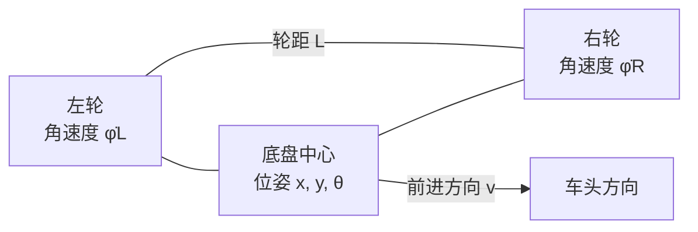

# 内训选题：差速移动机器人运动学入门

## 1. 课程概况

**课程名称：** 从左右轮速度到机器人轨迹：差速移动机器人运动学入门  
**面向对象：** 对机器人感兴趣的协会新成员，尤其是尚未系统学习运动学的同学。  
**课程时长：** 2 次课，每次 90 分钟。  
**课程形式：** 讲解、板书推导、仿真或小车演示、分组计算与复盘。  
**选题理由：** 差速底盘结构直观，常见于教学小车。通过左右轮速度可以自然引出机器人速度、姿态变化、正运动学和逆运动学，为后续里程计、路径跟踪和 ROS 移动机器人内容打下基础。

## 2. 课程目标

完成课程后，参与者能够：

1. 说明差速底盘如何通过左右轮的速度差实现直行、转弯和原地旋转。
2. 在图中标出机器人位姿 $(x,y,\theta)$、轮半径 $r$ 与轮距 $L$，并说明各量的单位和正方向。
3. 使用左右轮角速度计算底盘线速度和角速度，并能从目标底盘速度反算左右轮速度。
4. 根据平面运动学方程估算一个较短时间步内的位姿变化。
5. 通过仿真或小车实验比较理论运动与实际运动，并指出轮胎打滑、参数误差等偏差来源。

## 3. 先修基础与核心概念

不要求机器人或控制理论基础。建议参与者会进行基础代数运算，知道角度、弧度和速度的含义。课程开始时会简要复习单位换算。

本课程讨论**运动学**：描述几何结构和速度之间的关系，不分析电机转矩、质量、摩擦力等造成运动的力学原因。为了让模型成立，先假设小车在平坦地面上运动，左右轮纯滚动、没有明显侧滑，轮半径和轮距已知。

### 差速底盘示意

俯视时，车体前进方向为车体坐标系的 $x_b$ 轴，逆时针转向为正。左右轮的线速度分别为：

$$
v_L = r\dot{\phi}_L, \qquad v_R = r\dot{\phi}_R
$$

其中 $r$ 是车轮半径，$\dot{\phi}_L$、$\dot{\phi}_R$ 是左右轮角速度，单位为 $\mathrm{rad/s}$。

## 4. 课程主要内容

### 4.1 从轮速得到底盘速度：正运动学

选取左右驱动轮轴线的中点作为底盘参考点，底盘向前的线速度为 $v$，绕竖直轴的角速度为 $\Omega$。在无侧滑模型下：

$$
v=\frac{v_R+v_L}{2}=\frac{r}{2}(\dot{\phi}_R+\dot{\phi}_L)
$$

$$
\Omega=\frac{v_R-v_L}{L}=\frac{r}{L}(\dot{\phi}_R-\dot{\phi}_L)
$$

判断运动方向时先看轮速关系：

| 左右轮关系 | 理想运动 |
| --- | --- |
| $v_L=v_R>0$ | 直线前进 |
| $v_L=v_R<0$ | 直线后退 |
| $v_R>v_L$ | 向左转，$\Omega>0$ |
| $v_R=-v_L$ | 绕底盘中心原地旋转 |

### 4.2 从期望底盘速度得到轮速：逆运动学

如果希望底盘以线速度 $v$ 和角速度 $\Omega$ 运动，则左右轮线速度为：

$$
v_L=v-\frac{L}{2}\Omega, \qquad v_R=v+\frac{L}{2}\Omega
$$

换算成轮子的角速度：

$$
\dot{\phi}_L=\frac{v-\frac{L}{2}\Omega}{r}, \qquad
\dot{\phi}_R=\frac{v+\frac{L}{2}\Omega}{r}
$$

这组公式把“想让小车怎么走”转换为“左右轮各自需要多快”。实际硬件还需要电机驱动和速度闭环等环节，这些不作为本课的推导重点。

### 4.3 底盘速度如何改变平面位姿

设世界坐标系下底盘中心的位置为 $(x,y)$，车头朝向角为 $\theta$。底盘前进方向会随车头转动，因此：

$$
\dot{x}=v\cos\theta,\qquad
\dot{y}=v\sin\theta,\qquad
\dot{\theta}=\Omega
$$

一个简单的数值积分方法是欧拉法。对较小的时间间隔 $\Delta t$，可以估算：

$$
x_{k+1}=x_k+v_k\cos\theta_k\Delta t
$$
$$
y_{k+1}=y_k+v_k\sin\theta_k\Delta t
$$
$$
\theta_{k+1}=\theta_k+\Omega_k\Delta t
$$

要提醒初学者：这是小步长近似。步长越大，近似误差通常越明显。真实小车还会受到轮胎打滑、地面不平和轮径误差影响。

### 4.4 带数字的例题

某差速小车轮半径 $r=0.03\,\mathrm{m}$，轮距 $L=0.16\,\mathrm{m}$。左右轮角速度分别为 $\dot{\phi}_L=5\,\mathrm{rad/s}$、$\dot{\phi}_R=7\,\mathrm{rad/s}$。求底盘的线速度和角速度。

先计算轮缘线速度：

$$
v_L=0.03\times5=0.15\,\mathrm{m/s},\qquad
v_R=0.03\times7=0.21\,\mathrm{m/s}
$$

因此：

$$
v=\frac{0.15+0.21}{2}=0.18\,\mathrm{m/s},\qquad
\Omega=\frac{0.21-0.15}{0.16}=0.375\,\mathrm{rad/s}
$$

左轮比右轮慢，所以小车向左转。计算结果应同时检查单位、左右轮顺序和转向符号。

## 5. 教学安排

### 第一次课：建立模型并完成手算，90 分钟

| 时间 | 教学环节 | 教学活动与检查点 |
| --- | --- | --- |
| 0–10 分钟 | 情境导入 | 展示差速小车直行、转弯和原地旋转。请学员预测左右轮分别如何转。 |
| 10–25 分钟 | 坐标与参数 | 标出车体坐标系、世界坐标系、位姿、轮半径和轮距。讲解角度、弧度和单位。 |
| 25–45 分钟 | 正运动学 | 从两轮速度关系推导 $v$ 与 $\Omega$。用运动方向表检查符号理解。 |
| 45–60 分钟 | 例题与同伴练习 | 分组计算一组给定轮速；每组解释结果方向和单位。 |
| 60–75 分钟 | 逆运动学 | 从目标 $(v,\Omega)$ 推出左右轮速度，练习直行、缓慢左转和原地转向。 |
| 75–85 分钟 | 位姿变化 | 使用平面运动方程和欧拉法手算一个时间步。 |
| 85–90 分钟 | 小结与出口题 | 学员独立回答“为什么左右轮同速时不转弯？”并提交一题轮速计算。 |

### 第二次课：仿真或实车验证，90 分钟

| 时间 | 教学环节 | 教学活动与检查点 |
| --- | --- | --- |
| 0–10 分钟 | 回顾 | 快速复习正逆运动学公式和符号约定。 |
| 10–25 分钟 | 参数测量 | 测量或读取轮半径、轮距；讨论测量误差会如何影响计算。 |
| 25–45 分钟 | 预测轨迹 | 小组选择一组左右轮速度，先计算 $v$、$\Omega$，再画出预计运动方向。 |
| 45–70 分钟 | 仿真或实车实践 | 运行直行、弧线转弯和原地旋转三个动作，记录设定值和观察结果。 |
| 70–82 分钟 | 对比与排查 | 对比模型预测和实际表现，讨论轮子方向、单位、轮距、地面打滑等因素。 |
| 82–90 分钟 | 展示与总结 | 每组展示一个实验结果，并说明运动学模型的适用条件和局限。 |

## 6. 实践任务与评价

**实践任务：** 给定小车参数和目标运动，先用逆运动学计算左右轮速度，再通过仿真或实车执行，最后用正运动学解释观察到的运动。

建议任务组：

1. $v=0.15\,\mathrm{m/s},\ \Omega=0$：直线行驶。
2. $v=0.15\,\mathrm{m/s},\ \Omega=0.5\,\mathrm{rad/s}$：向左转弯。
3. $v=0,\ \Omega=0.5\,\mathrm{rad/s}$：原地旋转。

**评价方式：** 课堂提问与手算占 40%，实践记录和方向判断占 40%，小组解释模型假设及误差来源占 20%。重点看推理过程、单位和符号是否一致，不以轨迹是否完美作为唯一标准。

## 7. 所需软硬件与条件

| 项目 | 需求 | 备选方案 |
| --- | --- | --- |
| 场地 | 平整、空旷的桌面或地面，留出小车运行区域 | 全程使用仿真 |
| 硬件 | 差速小车底盘、两路电机驱动、电源；有编码器更适合比较轮速 | 用纸面轮速题和屏幕仿真替代实车 |
| 软件 | 电脑上的表格工具或简单脚本，用于计算和记录 | 纸笔手算即可完成核心内容 |
| 教学材料 | 白板/投影、卷尺、胶带标记起点和轨迹 | 使用预先准备的轨迹示意图 |
| 经费 | 若借用协会现有小车，新增耗材可控制在约 0–50 元；若需新购底盘，按学校采购渠道询价 | 课程不依赖购置新设备 |

预算是按已有教学设备估算的耗材范围。新购小车、电池或驱动板的费用会随型号和采购渠道变化，应在开课前确认。

## 8. 可能遇到的问题与解决办法

| 可能问题 | 解决办法 |
| --- | --- |
| 把角速度 $\mathrm{rad/s}$ 与转速 $\mathrm{rpm}$ 混用 | 先统一单位。需要换算时使用 $1\,\mathrm{rpm}=2\pi/60\,\mathrm{rad/s}$。 |
| 左右轮顺序或正方向导致转向符号相反 | 在每道题开头明确车头方向、左右轮定义和逆时针为正，并先用原地转向做符号自检。 |
| 误以为运动学可以直接给出电机 PWM | 明确本课计算的是轮速与底盘速度关系。PWM 到轮速还受电机、电源、负载和控制器影响。 |
| 仿真正确而实车轨迹偏差较大 | 先检查轮径、轮距、接线方向和编码器读数，再讨论地面摩擦、轮胎打滑和左右电机差异。 |
| 学员数学基础差异较大 | 先给出速度、角速度与弧度的例题；小组练习设置基础题和拓展题，推导过程提供图示辅助。 |
| 实车或软件临时不可用 | 提前准备轮速表、轨迹纸面题和离线演示视频，确保核心推理环节仍可完成。 |

## 9. 教学重点与边界

**重点：** 左右轮线速度到车体 $(v,\Omega)$ 的映射，车体速度到左右轮速度的逆映射，以及坐标方向、单位和符号的一致性。

**难点：** 理解底盘的线速度方向随姿态角 $\theta$ 变化；区分理想运动学模型和真实小车的误差。

**本课程不展开：** 电机动力学、PID 速度控制、SLAM、路径规划和机械臂逆运动学。这些主题可以作为后续课程。

## 10. 参考资料

1. Kevin M. Lynch、Frank C. Park，*Modern Robotics*，第 13 章“Wheeled Mobile Robots”，在线教材：<https://modernrobotics.northwestern.edu/chapters/chapter13/>。
2. *Modern Robotics*，13.1 “Wheeled Mobile Robots”：<https://modernrobotics.northwestern.edu/nu-gm-book-resource/13-1-wheeled-mobile-robots/>。
3. *Modern Robotics*，13.3.1 “Modeling of Nonholonomic Wheeled Mobile Robots”：<https://modernrobotics.northwestern.edu/nu-gm-book-resource/13-3-1-modeling-of-nonholonomic-wheeled-mobile-robots/>。

本方案中的差速底盘模型采用无侧滑的理想假设。实际授课时应结合协会小车参数重新测量轮半径与轮距，并用实际实验结果说明模型误差。
